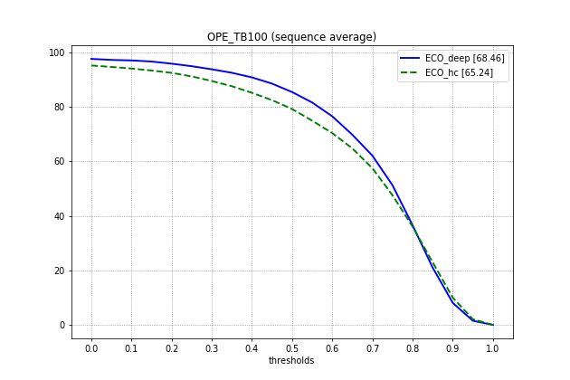
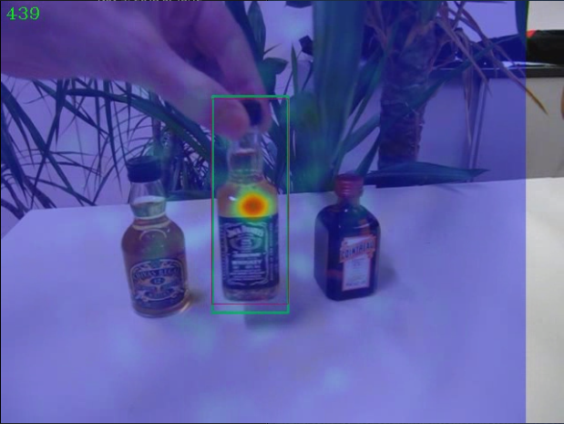

# Python Implementation of ECO

## Run demo
```bash
cd pyECO/eco/features/

python setup.py build_ext --inplace

pip install numpy scipy python-opencv glob pandas pillow

# if you want to use deep feature 
pip install mxnet-cu80(or 90 according to your cuda version)
pip install cupy-cu80(or 90 according to your cuda version)

cd pyECO/

python bin/demo_ECO_hc.py --video_dir path/to/video
```

## Convert to deep feature version

uncomment eco/config/config.py at line5 and comment eco/config/config.py at line 6

## Benchmark results

#### OTB100  

| Tracker  | AUC           | Speed                 |
| -------- | ------------- | --------------------- |
| ECO_deep | 68.7(vs 69.1) | 6~8fps on GTX 1080 Ti |
| ECO_hc   | 65.2(vs 65.0) | 40~60fps on Intel i5  |



## Visualization Results



## Note

we use ResNet50 feature instead of the original imagenet-vgg-m-2048

code tested on mac os 10.13 and python 3.6, ubuntu 16.04 and python 3.6 

## Reference
[1] Danelljan, Martin and Bhat, Goutam and Shahbaz Khan, Fahad and Felsberg, Michael
​    ECO: Efficient Convolution Operators for Tracking
​    In Conference on Computer Vision and Pattern Recognition (CVPR), 2017
